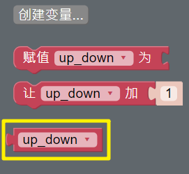
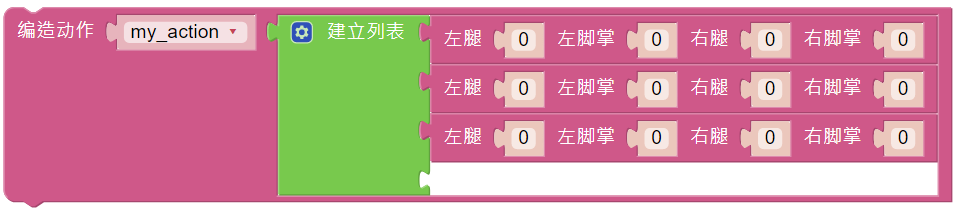
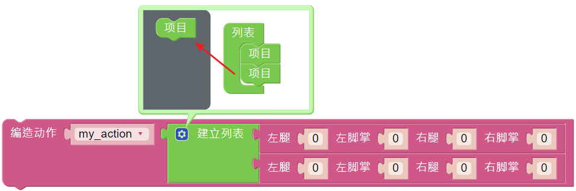

Custom Action
=============================

In the previous project, we were able to give PiSloth custom steps, so how do we combine these steps into actions?

For example, have PiSloth make the step from the previous project and then return to the initial position.

.. image:: media/diy_pic.jpg
  :width: 400
  :align: center

.. note::

  You can download and print the `PDF Cartoon Mask <https://github.com/sunfounder/sf-pdf/tree/master/prop_card/cartoon_mask>`_ for your PiSloth.

**TIPS**

Create a variable **up_down** to store this action.

You can use the **create action** block to make PiSloth do this action. These values ​​represent the angles of the 4 Servos on the PiSloth. The range is (-90~90).

Here you can increase or decrease the number of items by dragging it.

Fill in the angle obtained in the previous project and name this action **up_down** (drag it from **Variables** category).

.. image:: media/diy_up.png

Use the **do** block to make PiSloth do this action once at 50% speed.

.. image:: media/DIY6.png

**EXAMPLE**

.. image:: media/DIY7.png