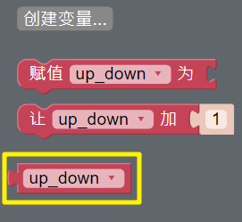
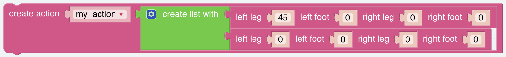
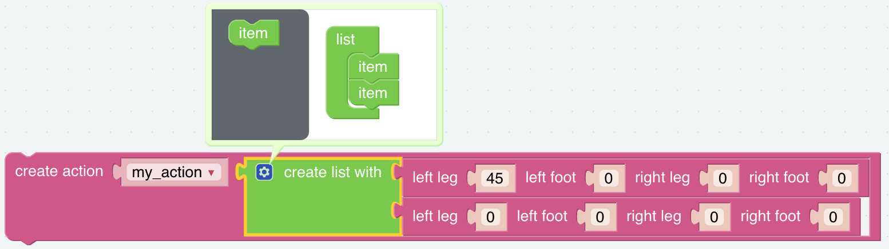
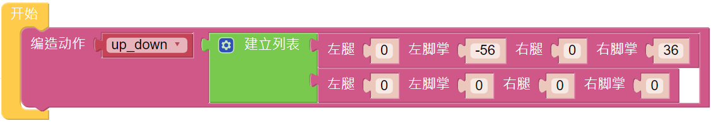
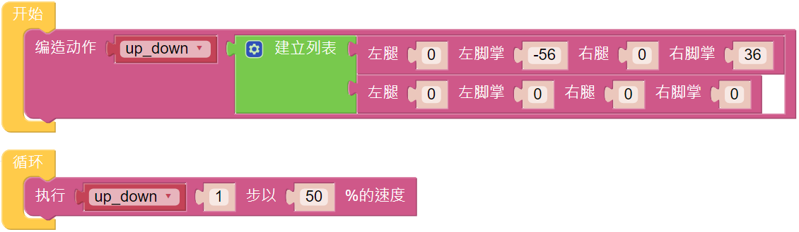

.. note::

    Hello, welcome to the SunFounder Raspberry Pi & Arduino & ESP32 Enthusiasts Community on Facebook! Dive deeper into Raspberry Pi, Arduino, and ESP32 with fellow enthusiasts.

    **Why Join?**

    - **Expert Support**: Solve post-sale issues and technical challenges with help from our community and team.
    - **Learn & Share**: Exchange tips and tutorials to enhance your skills.
    - **Exclusive Previews**: Get early access to new product announcements and sneak peeks.
    - **Special Discounts**: Enjoy exclusive discounts on our newest products.
    - **Festive Promotions and Giveaways**: Take part in giveaways and holiday promotions.

    👉 Ready to explore and create with us? Click [|link_sf_facebook|] and join today!

Custom Action
=============================

In the previous project, we were able to give PiSloth custom steps, so how do we combine these steps into actions?

For example, have PiSloth make the step from the previous project and then return to the initial position.

.. image:: img/diy_pic.jpg
  :width: 400
  :align: center

.. note::

  You can download and print the `PDF Cartoon Mask <https://github.com/sunfounder/sf-pdf/tree/master/prop_card/cartoon_mask>`_ for your PiSloth.

**TIPS**

Create a variable **up_down** to store this action.

You can use the **create action** block to make PiSloth do this action. These values ​​represent the angles of the 4 Servos on the PiSloth. The range is (-90~90).

Here you can increase or decrease the number of items by dragging it.

Fill in the angle obtained in the previous project and name this action **up_down** (drag it from **Variables** category).

Use the **do** block to make PiSloth do this action once at 50% speed.

**EXAMPLE**

.. note::
    * You can write the program according to the following picture, please refer to the tutorial: :ref:`ezblock:create_project_latest`

    * Or find the code with the same name on the Examples page of the EzBlock Studio and click Run or Edit directly.

