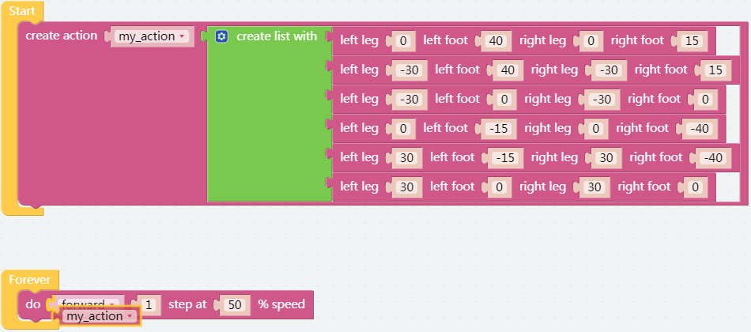
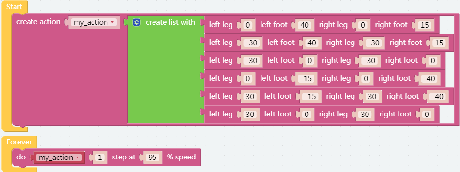

自定义动作
=============================

在之前的项目中，我们能够给 PiSloth 自定义步态，那么我们如何将这些步态组合成动作呢？

例如，让 PiSloth 摆出上一个项目中步态，然后回到站立姿势，如此循环实现蹦蹦跳跳的效果。

.. image:: img/diy_pic.jpg
  :width: 400
  :align: center

.. note::

    您可以为您的 PiSloth 下载并打印卡通面具。
    
    * `卡通面具（.pdf） <https://gitee.com/sunfounder/sf-pdf/tree/master/%E5%8D%A1%E7%89%87/%E5%8D%A1%E9%80%9A%E9%9D%A2%E5%85%B7>`_

**提示**

创建一个变量 **up_down** 来存储这个动作。

.. image:: img/up_down.png

您可以使用 **编造动作** 块让 PiSloth 执行这些动作。 这些值代表了 PiSloth 上 4 个舵机的角度。 范围是（-90~90）。

在这里，您可以通过拖动来增加或减少项目的数量。

填写上一个项目中获得的角度，并将此操作命名为 **up_down** （从 **变量** 中拖出它）。

.. image:: img/diy_up.png

使用 **执行** 块让 PiSloth 以 50% 的速度执行一次此操作。

**示例**

.. note::

  你可以直接打开我们提供的示例或者是按照下图来编写程序，详细教程请参考 :ref:`open_create`。

