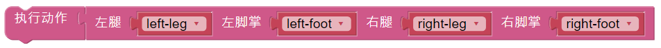

Custom Step
===============

In the previous projects, we used a lot of actions that we wrote, so how are these actions composed and done? Generally speaking, an action is composed of one or more steps.

In this project, we will learn how to customize PiSloth's step.

All we have to do is to use the buttons in the remote control page to make PiSloth complete the step shown in the figure below, and then get the angles of the 4 Servos at that time.

.. image:: media/diy_pic.jpg
  :width: 400
  :align: center

.. note::

  You can download and print the `PDF Cartoon Mask <https://github.com/sunfounder/sf-pdf/tree/master/prop_card/cartoon_mask>`_ for your PiSloth.

**Step 1:** Drag out 9 buttons in the Remote Control to control the rotation angles of the 4 Servos on the PiSloth.

.. image:: media/DIYII1.png

**Step 2:** Create 4 variables to store the angles of the 4 Servos.

.. image:: media/DIYII2.png
  :width: 600

Then initialize the angle to 0.

.. image:: media/DIYII3.png

**Step 3:** Reads the values of the different buttons that are used to control the angles of the Servos.

* **button AB** control the **left-leg**. 
* **button CD** control the **left-foot**. 
* **button EF** control the **right-leg**.
* **button GH** control the **right-foot**.
* Press **button I** and the angles of the 4 Servos will be printed in the Debug Monitor.

.. image:: media/DIYII4.png

**Step 4:** At the end of the Forever block, fill in the angle values read into the 4 servos and use the **do action** block to make PiSloth do this step.

**Step 5:** Once the code is complete, click the **download** icon in the bottom right corner to download and run the code. Now we can click **button CD** and **button GH** (according to the actual code) to make PiSloth pose like this, you can also make it do other steps.

.. image:: media/diy_pic.jpg
  :width: 400
  :align: center

**Step 6:** Click on the Debug Monitor icon in the bottom left corner, and you will see the angle of the 4 servos in the Debug Monitor at that moment when you press **button I**.

.. note::

  Some times more than 2 sets of data may appear because if you click **button I** for a little longer, Ezblock will think **button I** was clicked 2 times. You can clear the data and click button I again.

.. image:: media/DIYII5.png

The complete code is as follows:

.. image:: media/DIYII.png