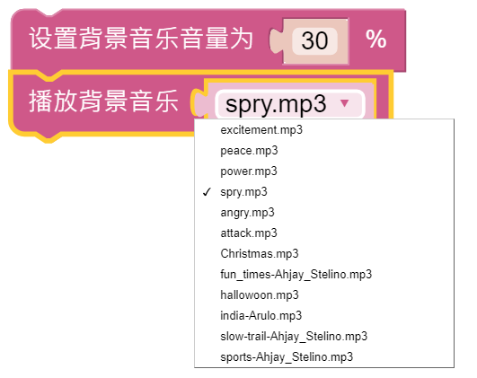
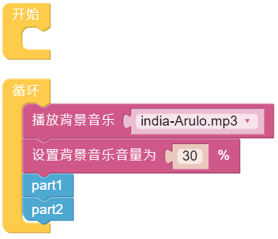

跳舞
=========

当当当当，有请 PiSltoh 向大家展示他新学的舞蹈。

.. image:: media/dance_pic.jpg
    :width: 400
    :align: center

.. note::

    您可以为您的 PiSloth 下载并打印卡通面具。
    
    * `卡通面具（.pdf） <https://gitee.com/sunfounder/sf-pdf/tree/master/%E5%8D%A1%E7%89%87/%E5%8D%A1%E9%80%9A%E9%9D%A2%E5%85%B7>`_

**提示**

PiSloth除了可以播放音效和说话，还可以播放设定好的背景音乐，背景音乐的音量可以调节（0%-100%）。

重复块可以帮助您多次执行相同的代码以减少代码大小。

.. image:: media/dance4.png

**示例**

整个舞蹈分为2个部分，PiSloth会随着音乐完成这2个部分。如果你不暂停代码，它会重复跳舞一直跳下去。

.. image:: media/dance6.png

.. image:: media/dance7.png

