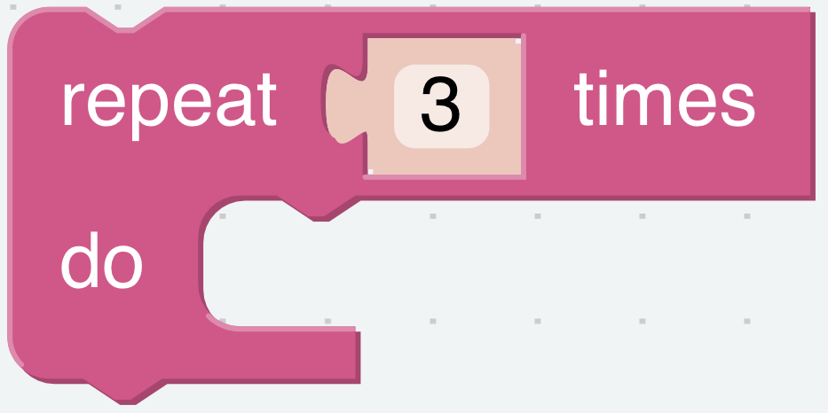
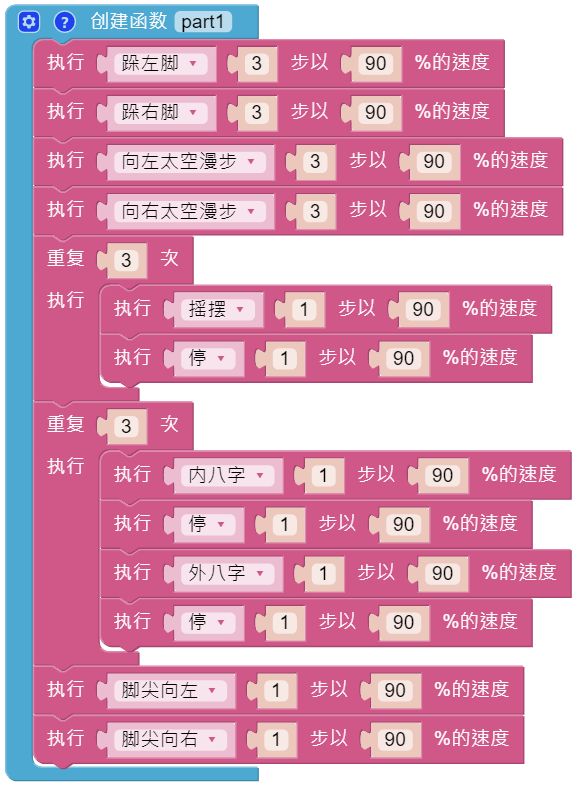
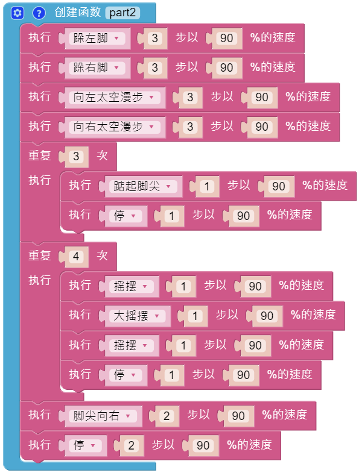
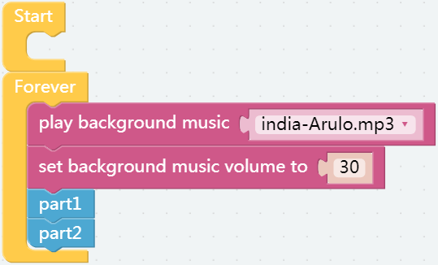

Dance
=========

Now, PiSltoh will show you his newly learned dance.

.. image:: img/dance_pic.jpg
    :width: 400
    :align: center

.. note::

    You can download and print the :download:`cardstock <https://github.com/sunfounder/sf-pdf/tree/master/assembly_file/card>` for your PiSloth.

**TIPS**

In addition to having PiSloth play sound effects and speak, it can also play set background music, and the volume of the background music can be adjusted (0%-100%).

.. image:: img/bg_volume.png

Repeat block can help you execute the same code multiple times to reduce code size.

**EXAMPLE**

The whole dance is divided into 2 parts, and PiSloth will finish these 2 parts with the music. If you don't pause the code, it will repeat the dance.

