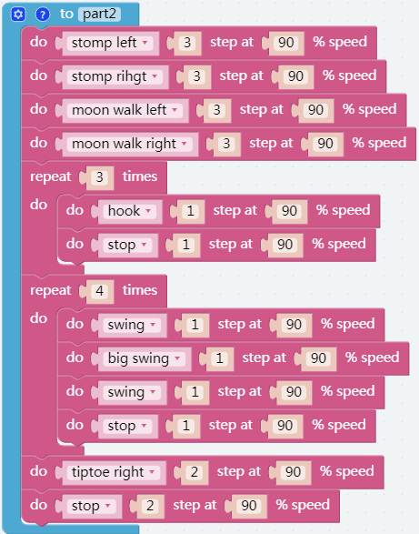

Dance
=========

In this project, we would play a piece of music and make Pisloth dance to the rhythm of the music.

Cute Pisloth and good music can put you in a good mood.

**TIPS**

This block can play some music that we have preset.

And then you can adjust the volume with this block.

You may want to use repeat which can help you repeatedly execute the same statement and reduce code size.

**EXAMPLE**

.. image:: img/dance6.png

.. image:: img/dance8.png
