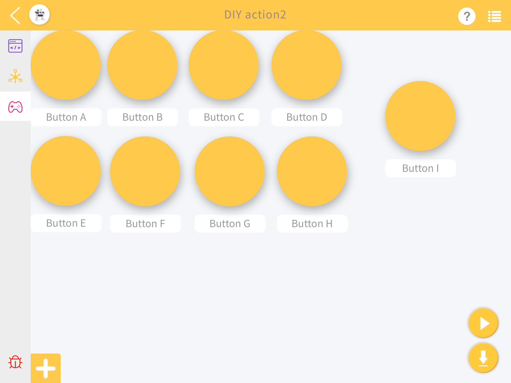
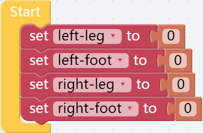
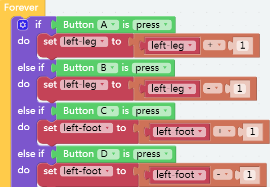
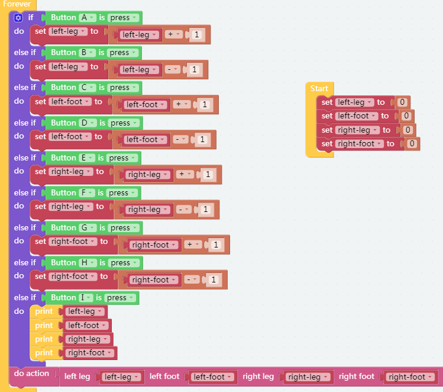

DIY Action2
===============

Through the last lesson, I learned how to customize the movement of Pisloth. In this lesson, we will directly control the Pisloth's four-servo through the control-widget, so that you can have a more intuitive understanding of the Pisloth's operating machine. Help you customize some more interesting actions.

**TIPS**

First,we can drag 9 buttons to control the rotation angles of the four servos on the pisloth leg.

Variables can be created on this page. We create four variables to represent the rotation angles of the four servos.

Then initialize the rotation angle to zero.

Set the value of the servo rotation plus 1 or minus 1 each time you press the key.

Press Button I to make the screen print out the rotation values ​​of the four servos, which can be seen in the control window in the lower left corner.

Finally, on the Pisloth page, you can use these two blocks to view the actual action effect.

**EXAMPLE**

