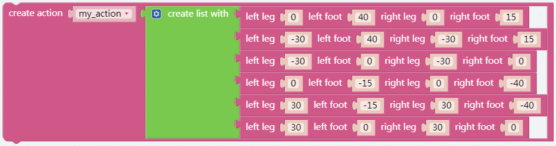
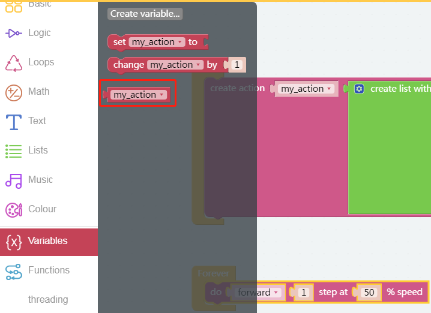

DIY Action
===============

Through the previous courses, do you have a deeper understanding of Pisloth? And next let's try to design the movement of Pisloth by ourselves.

**TIPS**

You can use this block on the PiSloth page to design the Pisloth action yourself.

.. image:: img/DIY2.png
 
These values ​​represent the rotation angles of the four servos on the pisloth leg. The range is (-90~90). We will introduce this in detail in the next lesson.。

.. image:: img/DIY3.png

Here you can increase or decrease the number of items by dragging it, so as to make more action of the pisloth.

This combination can make Pisloth perform familiar movements, let’s have a try.

Then you can find our customized action here.

.. image:: img/DIY6.png

Drag it and replace.

**EXAMPLE**

.. image:: img/DIY7.png