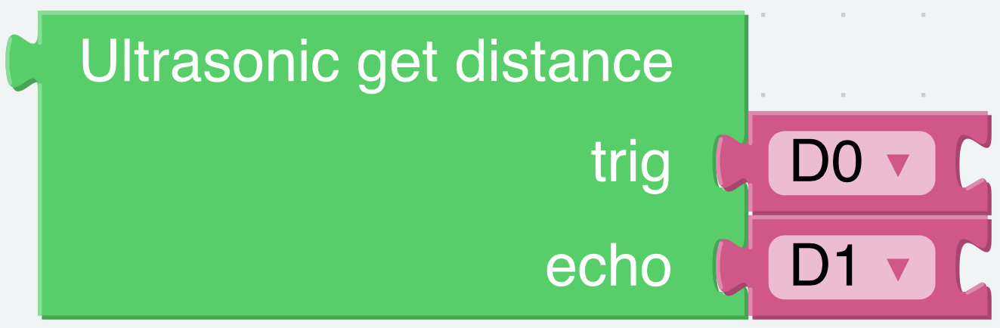
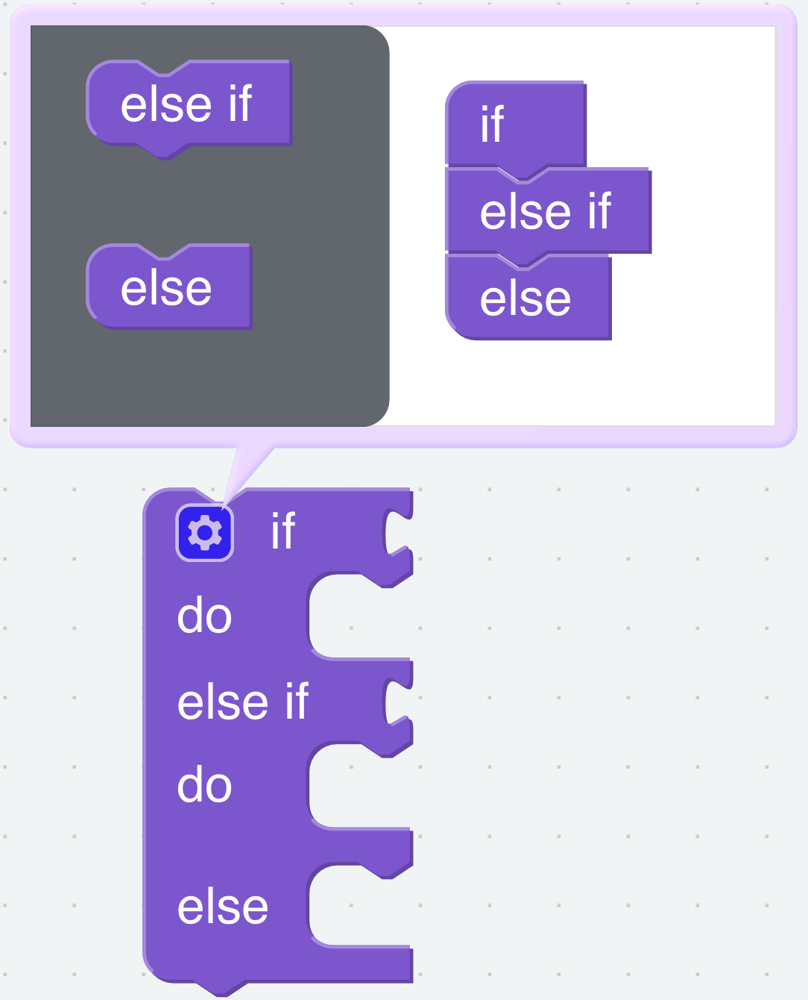
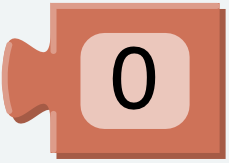
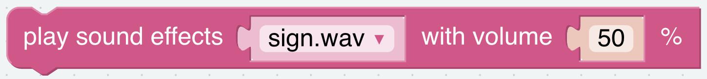

.. _donot_touch_me:

Don't Touch Me
==================

If you don't meet PiSloth's needs, it will get angry and stay away from your touch.

**TIPS**

You can directly use this block to read the distance to the obstacle right ahead.

.. note::

    When assembling, Trig and Echo are connected to D2 and D3 respectively, you also need to change them simultaneously when programming.

To achieve conditional judgment of \"if\" type, you need to use an **if do** block. 

When you need to implement multiple conditional judgments, you will have to change **if do** into **if else do**. This can be achieved by clicking on the **setting** icon.

You need to use a conditional statements block in conjunction with if do. Judging conditions can be \"=\", \">\", \"<\", \"≥\", \"≤\", \"≠\".

.. image:: img/Obstacle3.png

A number block.

This block can emit some preset sound effects, such as siren sound, gun sound and so on. The range of volume is 1~100.

**EXAMPLE**

.. note::
    * You can write the program according to the following picture, please refer to the tutorial: :ref:`ezblock:create_project_latest`

    * Or find the code with the same name on the Examples page of the EzBlock Studio and click Run or Edit directly.

.. image:: img/no_touch.png