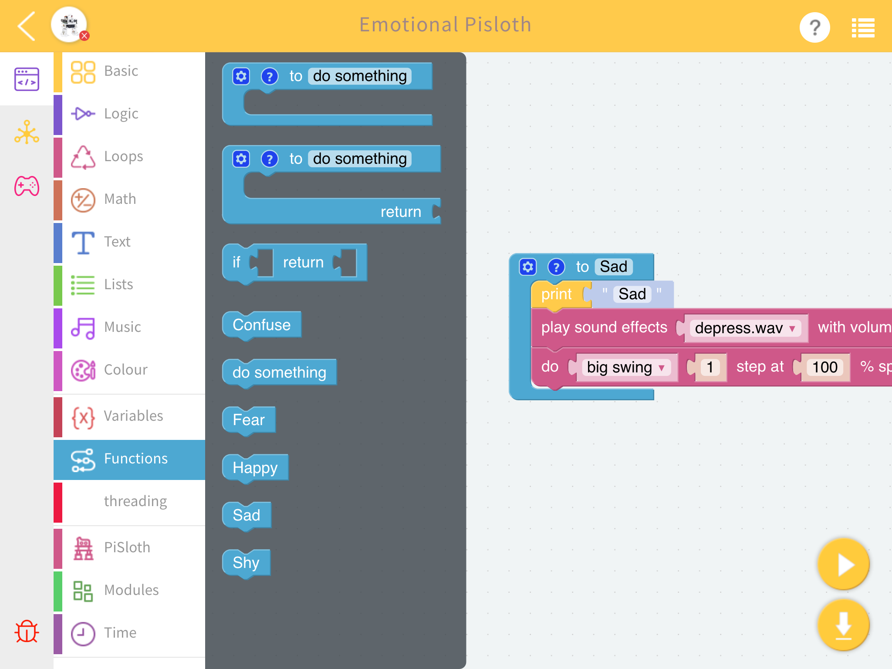
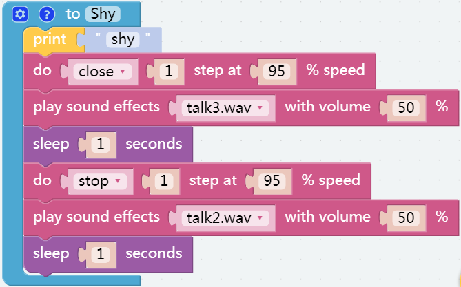
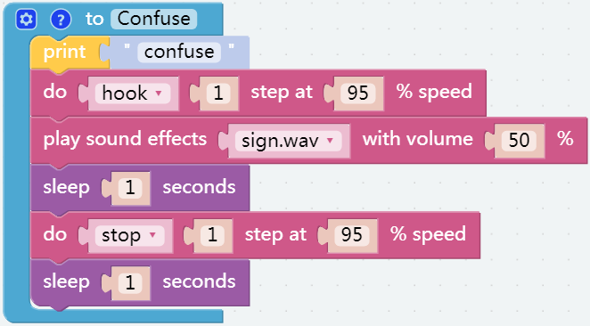
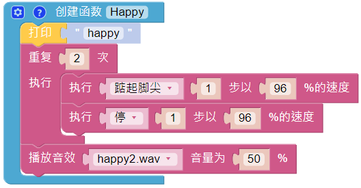
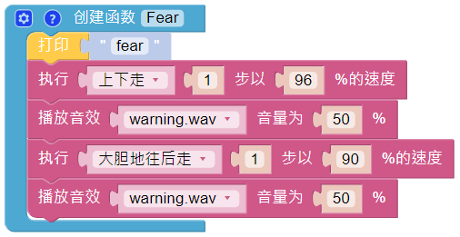
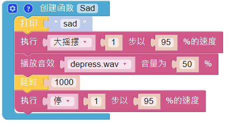
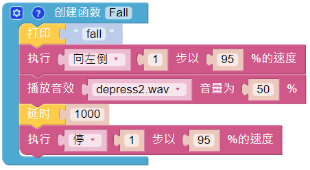
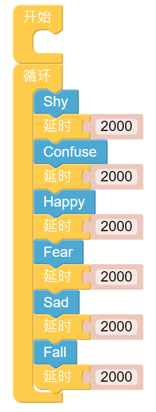

Emotional PiSloth
=======================

PiSloth is very emotional, sometimes happy, sometimes shy, sometimes confused.

**TIPS**

You may want to simplify the program with **Functions**, especially when you perform the same operation multiple times. Putting these operations into a newly declared function can greatly facilitate your use.

Click on the **Functions** category and select the appropriate function block, the function you created will also appear here.

The **Function** block without output is used here.

.. image:: img/function_name.png

**EXAMPLE**

**Shy**

**Confuse**

**Happy**

**Fear**

**Sad**

**Fall**

Call all custom functions in the Forever block.

