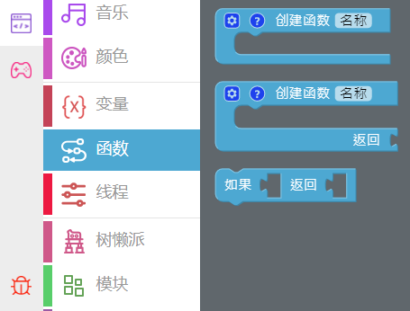
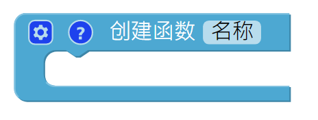
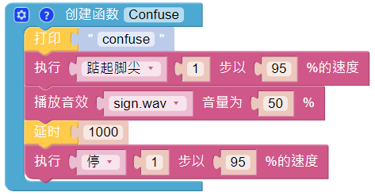

Emotional PiSloth
=======================

PiSloth is very emotional, sometimes happy, sometimes shy, sometimes confused.

**TIPS**

You may want to simplify the program with **Functions**, especially when you perform the same operation multiple times. Putting these operations into a newly declared function can greatly facilitate your use.

Click on the **Functions** category and select the appropriate function block, the function you created will also appear here.

The **Function** block without output is used here.

**EXAMPLE**

**Shy**

.. image:: media/shy.png

**Confuse**

**Happy**

.. image:: media/happy.png

**Fear**

.. image:: media/fear.png

**Sad**

.. image:: media/sad.png

**Fall**

.. image:: media/fall.png

Call all custom functions in the Forever block.

.. image:: media/emotional.png