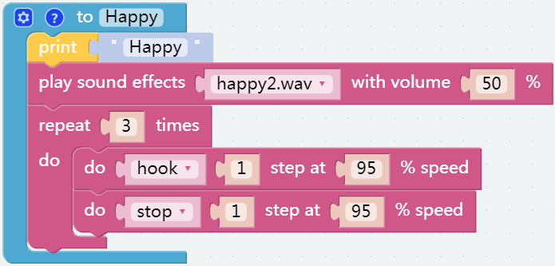

Emotional PiSloth
=======================

PiSloth is very emotional, sometimes happy, sometimes shy, sometimes confused.

**TIPS**

You may want to simplify the program with **Functions**, especially when you perform the same operation multiple times. Putting these operations into a newly declared function can greatly facilitate your use.

Click on the **Functions** category and select the appropriate function block, the function you created will also appear here.

The **Function** block without output is used here.

.. image:: img/function_name.png

**EXAMPLE**

.. note::
    * You can write the program according to the following picture, please refer to the tutorial: :ref:`ezblock:create_project_latest`

    * Or find the code with the same name on the Examples page of the EzBlock Studio and click Run or Edit directly.

**Shy**

.. image:: img/shy.png

**Confuse**

.. image:: img/confuse.png

**Happy**

**Fear**

.. image:: img/fear.png

**Sad**

.. image:: img/sad.png

**Fall**

.. image:: img/fall.png

Call all custom functions in the Forever block.

.. image:: img/emotional.png