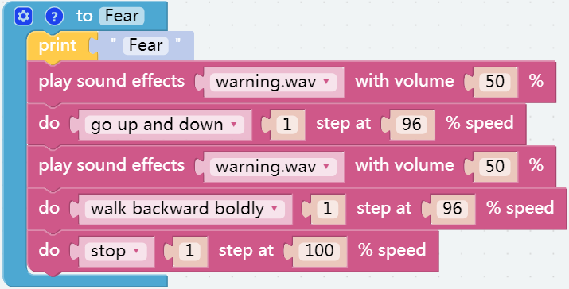

情绪丰富的 PiSloth
=======================

PiSloth 拥有非常多的情绪。时而快乐，时而害羞，时而迷茫。

**提示**

您可能希望使用 **函数** 来简化程序，尤其是当您多次执行相同的操作时。把这些操作放到一个新声明的函数中，可以大大方便你的使用。

单击 **函数** 类别并选择相应的功能块，您创建的功能也会出现在这里。

.. image:: img/emotional2.png
  :width: 600

此处使用无输出的 **函数** 块。

.. image:: img/function_name.png

**示例**

.. note::

  你可以直接打开我们提供的示例或者是按照下图来编写程序，详细教程请参考 :ref:`open_create`。

**Shy(害羞)**

.. image:: img/shy.png

**Confuse(迷惑)**

**Happy(快乐)**

.. image:: img/happy.png

**Fear(害怕)**

**Sad(伤心)**

.. image:: img/sad.png

**Fall(摔倒)**

.. image:: img/fall.png

在 **循环** 块中的调用所有自定义函数。

.. image:: img/emotional.png