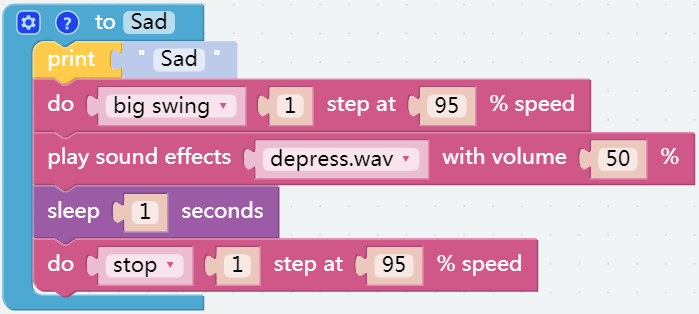
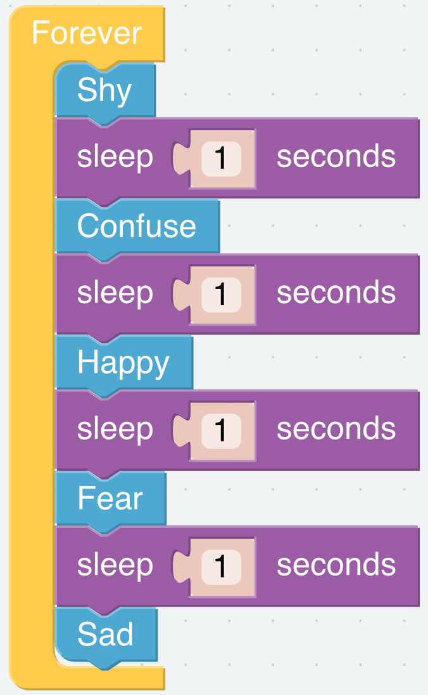

Emotional PiSloth
=======================

In this project, we will make the Pisloth more vivid, and we will make it show more human emotions. Of course, after learning this lesson, you can also design more emotions yourself.

**TIPS**

You may want to simplify the program with Functions, especially when you perform the same operation multiple times. Putting these operations into a newly declared function can greatly facilitate your use.

.. image:: img/emotional2.png

You can find and call the function block you wrote here.

**EXAMPLE**

**shy:**

**confuse:**

.. image:: img/confuse.png

**happy:**

.. image:: img/happy.png

**fear:**

.. image:: img/fear.png

**sad:**

**call function**

