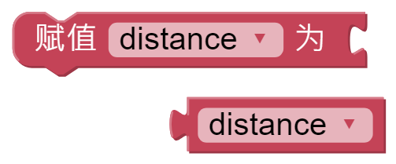
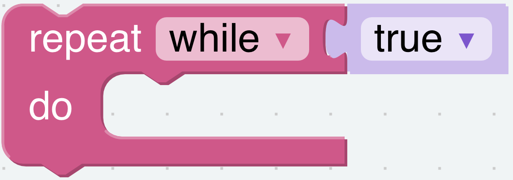
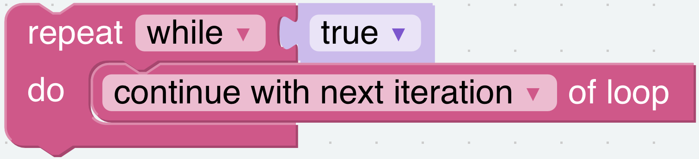
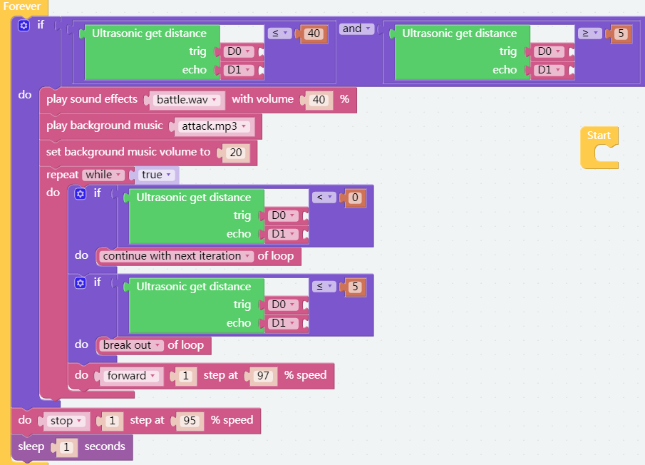

Let's Fight! Warrior!
=======================

Here, PiSloth is a brave warrior, when it appears in front of the enemy, it will let out a roar and rush to the enemy.

.. image:: img/warrir.jpg
  :width: 400
  :align: center

.. note::

  You can download the PiSloth cards here: :download:`warrior <https://github.com/sunfounder/sf-pdf/tree/master/assembly_file/card>`.

**TIPS**

You may want to simplify your program with Variable. For example, when you have multiple functions that need to read the obstacle distance, you don’t need to read the value for each function, just load the value into a variable and use it multiple times.

Click the **Create variable** button on the **Variables** category to create a variable named distance.

You can use this block to set up an endless loop.

This is a block that jumps out of the loop, and it has two options and can be only used within a loop.

* **break out**: Jump out of the entire loop.
* **continue with next interation**: Jump out of the current loop and enter the next loop.

**EXAMPLE**

After the code is run, PiSloth will continuously detect the distance of the obstacle, when the distance is between 5 and 40, PiSloth will make a roaring sound and rush forward; when the distance of the obstacle is less than 5, PiSloth will stop.

**Flow Chart**

.. image:: img/flowchart_fight.png
