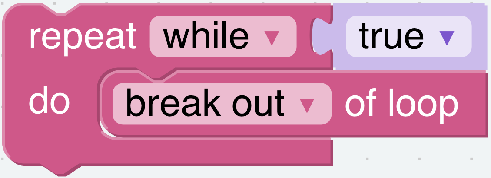
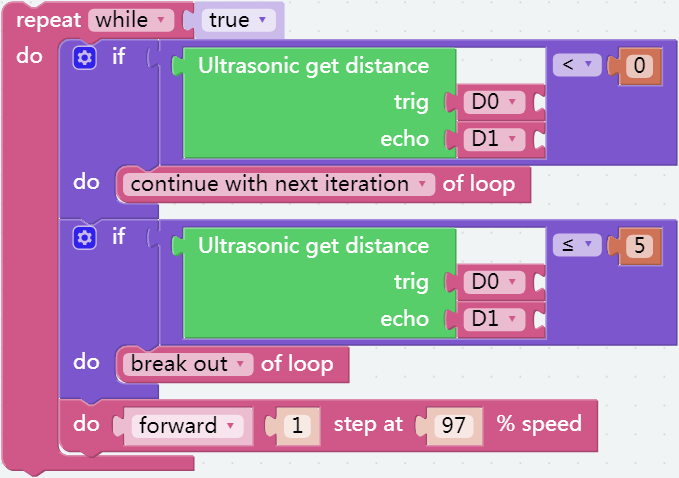

Let\'s fight! Warrior!
=======================

In this project, we will make Pisloth a warrior who will provoke you, and it will rush towards you full of fighting spirit.

**TIPS**

For the distance between Pisloth and the obstacle, we can set a range of 5 to 40 meters. In this range Pisloth will execute the forward action in a loop

.. image:: img/fight1.png
  :width: 350

You can use this block to set up an endless loop.

.. image:: img/fight2.png
  :width: 400

This block can jump out of the current loop and enter the next loop.

This block can jump out of the entire loop.

When the pisloth is too far away from the obstacle or the data is not read due to wire problems, the detected distance will be less than 0. Such a combination of blocks can help us ignore these interferences.

**EXAMPLE**

.. image:: img/fight.png