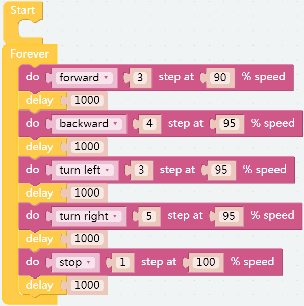

移动
========

.. note:: 

    在首页，点击 **示例**，进入示例页面，可以直接打开预设好的示例。 如果您只需要简单地测试这些示例，您只需点击 **运行** 即可让您的产品工作。
    
    .. image:: img/examples23.png

这是第一个项目。PiSloth醒来，并随意移动。

.. Before programming, you need to learn the basic usage of Ezblock Studio from here.

.. * `Quick User Guide for Ezblock 3 <https://docs.sunfounder.com/projects/ezblock3/en/latest/quick_user_guide_for_ezblock3.html>`_

.. * `How to Create a New Project? <https://docs.sunfounder.com/projects/ezblock3/en/latest/create_new.html>`_

.. image:: img/movement.png
  :align: center

**提示**

这是程序的基本结构， **开始** 块用于做一些初始化（即使没有放置块，也不能删除）而 **循环** 块，顾名思义，是一个连续的循环，可以让你的程序改变和回应。

该块用于让PiSloth以一个速度（%）做一个特定的动作几步，例如让 PiSloth 以 50% 的速度前进 1 步。

可以从下拉选项中选择不同的动作。

这是一个设置前一个block的时长的block，单位：ms。

**示例**

.. note::

    代码完成后，点击右下角的“下载&运行”按键，让机器人动起来。
    
    .. image:: img/sp211203_100817.png

你会看到PiSloth前进3步，后退4步，左3步，右5步，最后停止。由于整个代码都放在 **循环** 块中，PiSloth 会在停止一段时间后重复上述动作。

您可以尝试将 **循环** 块中的代码放入 **开始** 块中，看看有什么不同。

