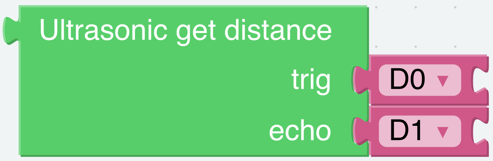
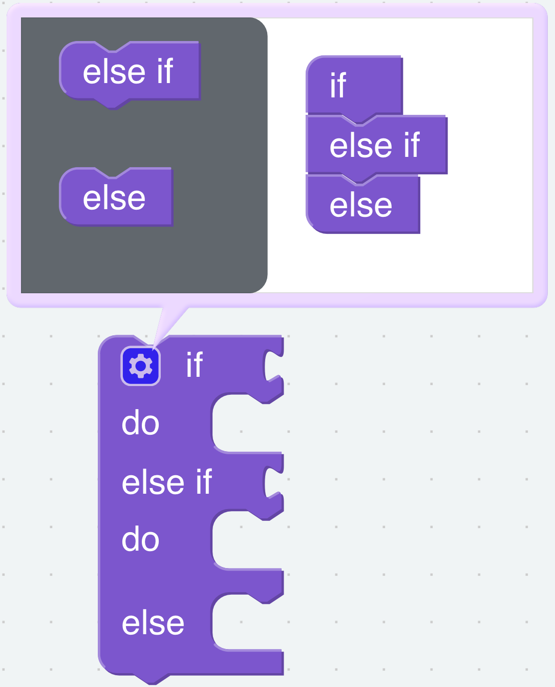
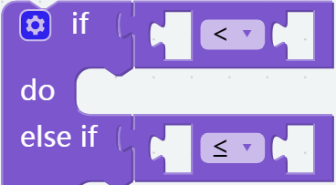
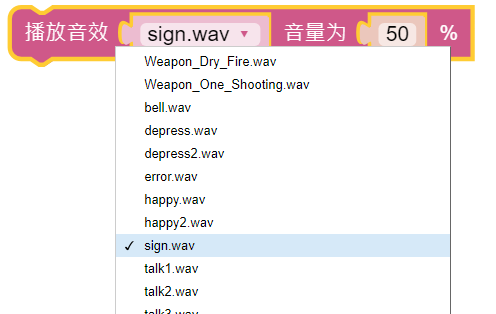
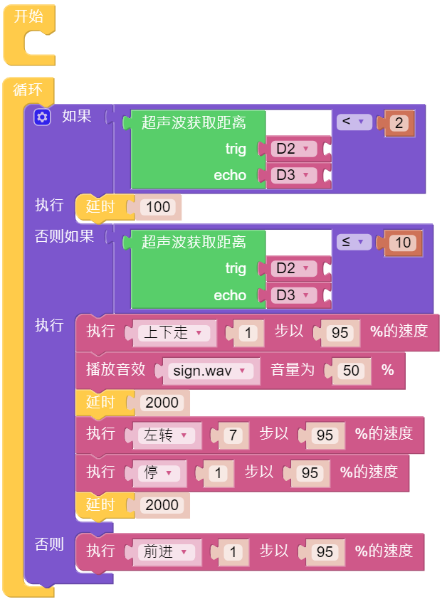

Obstacle Avoidance
=====================

In this project, Pisloth will use ultrasonic modules to detect obstacles ahead. When Pisloth detects an obstacle, he gives a signal, then backs away and looks for another way to move forward.

**TIPS**

You can directly use this block to read the distance to the obstacle right ahead.

To achieve conditional judgment of “if” type, you need to use an if do block. 

When you need to implement multiple conditional judgments, you will have to change if do into if else do or else if do. This can be achieved by clicking on the setting icon.

You need to use a conditional statements block in conjunction with if do. Judging conditions can be “=”, “>”, “<”, ” ≥ “, ” ≤ “, ” ≠ “.

Do nothing here means pass.

A number block.

This block can emit some preset sound effects. The range of volume is 1~100.

Pause the program for 0.2 seconds.

**EXAMPLE**

