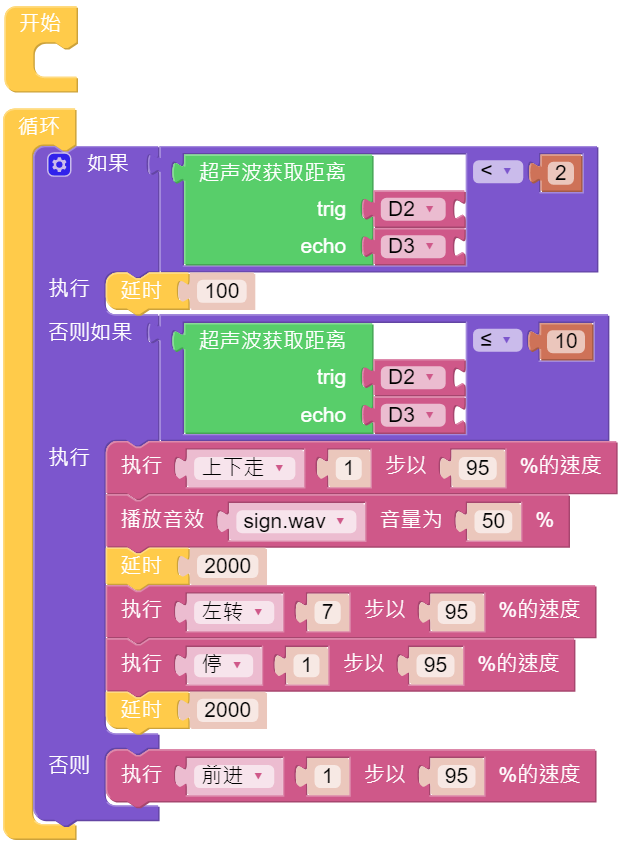

.. note::

    Hello, welcome to the SunFounder Raspberry Pi & Arduino & ESP32 Enthusiasts Community on Facebook! Dive deeper into Raspberry Pi, Arduino, and ESP32 with fellow enthusiasts.

    **Why Join?**

    - **Expert Support**: Solve post-sale issues and technical challenges with help from our community and team.
    - **Learn & Share**: Exchange tips and tutorials to enhance your skills.
    - **Exclusive Previews**: Get early access to new product announcements and sneak peeks.
    - **Special Discounts**: Enjoy exclusive discounts on our newest products.
    - **Festive Promotions and Giveaways**: Take part in giveaways and holiday promotions.

    👉 Ready to explore and create with us? Click [|link_sf_facebook|] and join today!

Obstacle Avoidance
=====================

In this project, when PiSloth detects an obstacle, it will send a signal and look for another direction to move forward.

**TIPS**

This is based on the previous project :ref:`donot_touch_me`, which adds autonomous judgment, so that PiSloth can actively avoid obstacles in front of it.

**EXAMPLE**

.. note::
    * You can write the program according to the following picture, please refer to the tutorial: :ref:`ezblock:create_project_latest`

    * Or find the code with the same name on the Examples page of the EzBlock Studio and click Run or Edit directly.

After the code runs, PiSloth will walk forward. If it detects that the distance of the obstacle ahead is less than 10cm, it will stop and sound a warning, then turn left for 7 steps and stop. If there is no obstacle in the direction after turning left or the obstacle distance is greater than 10, it will continue to move forward.

Since the effective detection distance of the ultrasonic sensor module is 2-400cm, when the detection distance is less than it will do nothing.

