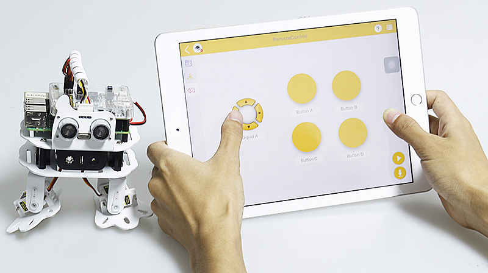
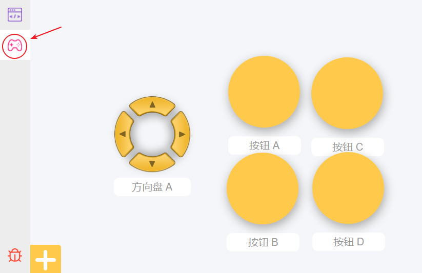
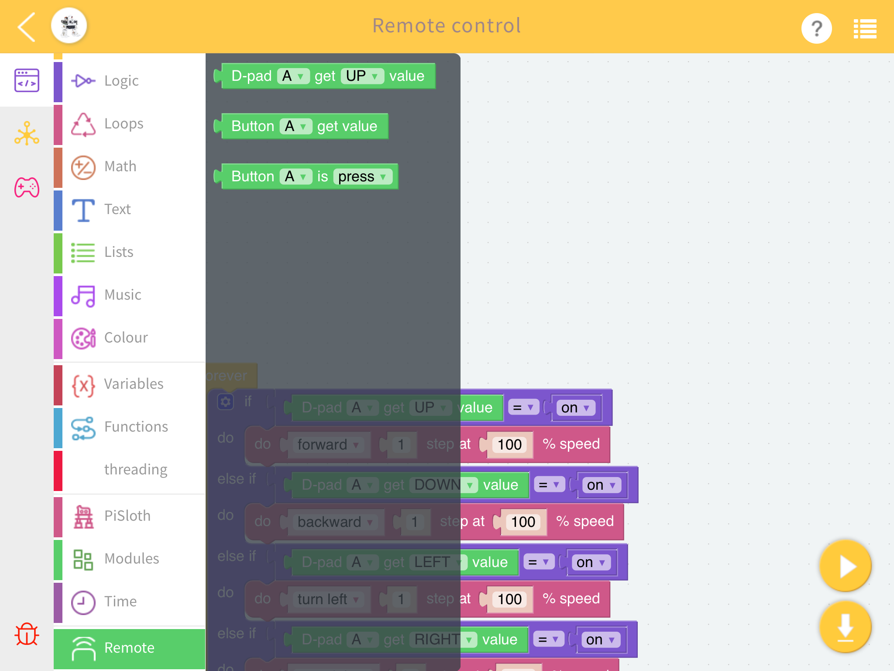
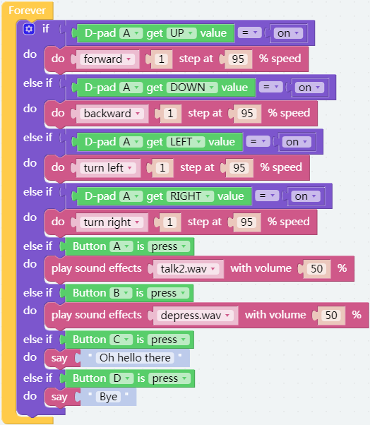

.. note::

    Hello, welcome to the SunFounder Raspberry Pi & Arduino & ESP32 Enthusiasts Community on Facebook! Dive deeper into Raspberry Pi, Arduino, and ESP32 with fellow enthusiasts.

    **Why Join?**

    - **Expert Support**: Solve post-sale issues and technical challenges with help from our community and team.
    - **Learn & Share**: Exchange tips and tutorials to enhance your skills.
    - **Exclusive Previews**: Get early access to new product announcements and sneak peeks.
    - **Special Discounts**: Enjoy exclusive discounts on our newest products.
    - **Festive Promotions and Giveaways**: Take part in giveaways and holiday promotions.

    👉 Ready to explore and create with us? Click [|link_sf_facebook|] and join today!

Remote Control
==================

You can also use the widgets on EzBlock Studio to make PiSloth move.

* :ref:`ezblock:remote_control_latest`

**TIPS**

To use the remote control function, you need to enter the **Remote Control** page from the left side of main page, and then drag one D-pad and 4 buttons to the central area.

Back in the programming page, you will see an additional Remote category, and the D-pad and Button block appear in it.

* **Button () get value**: This block is used to read the value of the buttons, if the button is pressed, the value is 1, otherwise it is 0.
* **Button () is (press/release)**: This block and ``Button () get value = (0/1)`` have the same effect and can be used directly to determine whether a button is pressed or not.
* **D-pad () get () value**: This block is used to read the up/down/left/right (selected through the drop-down menu) pad values, press for 1 and release for 0.

**EXAMPLE**

.. note::
    * You can write the program according to the following picture, please refer to the tutorial: :ref:`ezblock:create_project_latest`

    * Or find the code with the same name on the Examples page of the EzBlock Studio and click Run or Edit directly.

