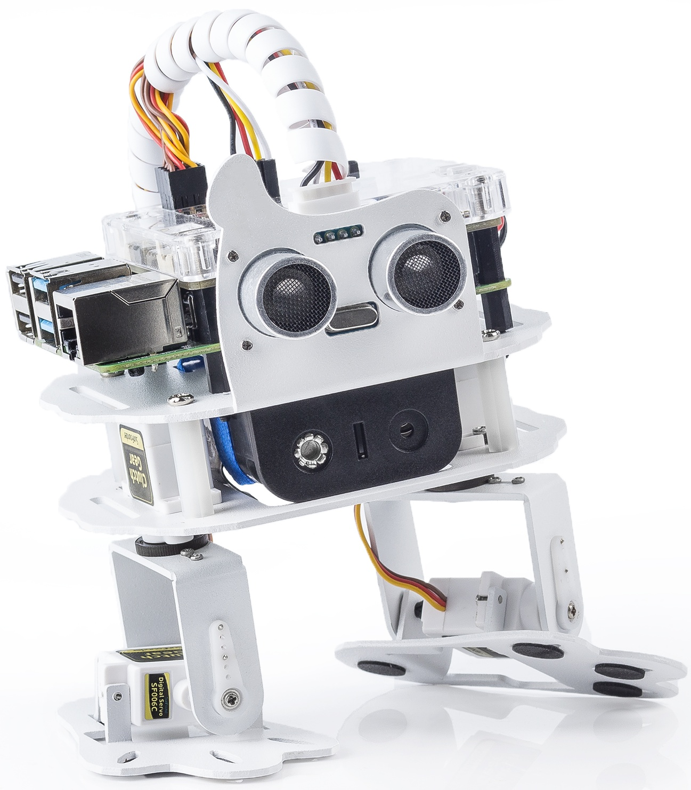

.. note::

    Hello, welcome to the SunFounder Raspberry Pi & Arduino & ESP32 Enthusiasts Community on Facebook! Dive deeper into Raspberry Pi, Arduino, and ESP32 with fellow enthusiasts.

    **Why Join?**

    - **Expert Support**: Solve post-sale issues and technical challenges with help from our community and team.
    - **Learn & Share**: Exchange tips and tutorials to enhance your skills.
    - **Exclusive Previews**: Get early access to new product announcements and sneak peeks.
    - **Special Discounts**: Enjoy exclusive discounts on our newest products.
    - **Festive Promotions and Giveaways**: Take part in giveaways and holiday promotions.

    👉 Ready to explore and create with us? Click [|link_sf_facebook|] and join today!

SunFounder Raspberry Pi Robot - |link_PiSloth|
===================================================

* |link_Pi_Sloth|

Thanks for choosing our |link_PiSloth|.

PiSloth is a Raspberry Pi Bionic robot with an aluminum alloy structure. It can talk, dance, and even express emotions, such as happiness and excitement.

It has 22 different actions, such as: Stomp, Swing and MoonWalk, and you can customize the actions according to your needs. PiSloth's eyes consist of an ultrasonic sensor module that can be used to detect distance for obstacle avoidance and following functions.

In this tutorial, a list and assembly pdf, introduction to Robot HAT, and programming of PiSloth are included.

The programming part is divided into two chapters: :ref:`play_ezblock` & :ref:`play_python`, and each of them can get you stated on making PiSloth work in way you want.

EzBlock Studio is a development platform developed by SunFounder designed for beginners to lower the barriers to getting started with Raspberry Pi. It has two programming languages: Graphical and Python, and available on almost all different types of devices. With Bluetooth and Wi-Fi support, you can download code, remote control a Raspberry Pi, on Ezblock Studio.

More experienced makers can use the popular programming language - Python.

**Content**

.. toctree::
   :maxdepth: 2

   list_and_assembly
   about_robot_hat 
   ezblock/play_with_ezblock
   python/play_with_python
   appendix/appendix
   thank-robot

Copyright Notice
--------------------------

All contents including but not limited to texts, images, and code in this manual are owned by the SunFounder Company. You should only use it for personal study,investigation, enjoyment, or other non-commercial or nonprofit purposes, under therelated regulations and copyrights laws, without infringing the legal rights of the author and relevant right holders. For any individual or organization that uses these for commercial profit without permission, the Company reserves the right to take legal action.

