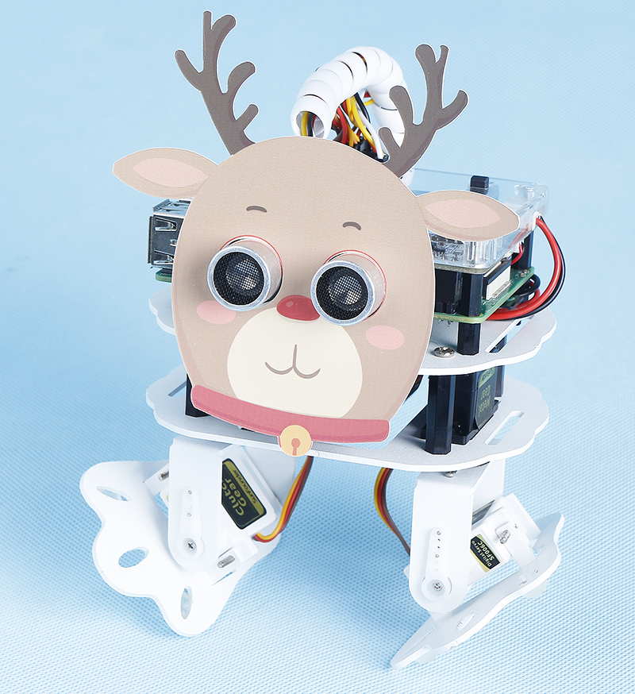

.. note::

    Hello, welcome to the SunFounder Raspberry Pi & Arduino & ESP32 Enthusiasts Community on Facebook! Dive deeper into Raspberry Pi, Arduino, and ESP32 with fellow enthusiasts.

    **Why Join?**

    - **Expert Support**: Solve post-sale issues and technical challenges with help from our community and team.
    - **Learn & Share**: Exchange tips and tutorials to enhance your skills.
    - **Exclusive Previews**: Get early access to new product announcements and sneak peeks.
    - **Special Discounts**: Enjoy exclusive discounts on our newest products.
    - **Festive Promotions and Giveaways**: Take part in giveaways and holiday promotions.

    👉 Ready to explore and create with us? Click [|link_sf_facebook|] and join today!

.. _custom_action_python:

Custom Action
===============

In the previous project, we were able to give PiSloth custom steps, so how do we combine these steps into actions?

For example, have PiSloth make the step from the previous project and then return to the initial position.

.. note::

    You can download and print the `PDF Cartoon Mask <https://github.com/sunfounder/sf-pdf/tree/master/prop_card/cartoon_mask>`_ for your PiSloth.

**Step 1**: Go to the ``~/pisloth/examples`` path.

.. code-block::

    cd ~/pisloth/examples

**Step 2**: Open ``custom_action.py`` with the following command.

.. code-block::

    nano custom_action.py

**Step 3**: Modify the angle in ``sloth.add_action()``, each group represents a step, and only 2 steps are set here. You can set multiple steps as needed.

.. code-block:: python

    sloth.add_action("my_action", [
        [ 0,-45  ,0, 40],
        [0,   0, 0,   0]
        ])

**Step 4**: Run this code.

.. code-block::

    sudo python3 custom_action.py

**Code**

.. note::
    You can **Modify/Reset/Copy/Run/Stop** the code below. But before that, you need to go to  source code path like ``pisloth\examples``. After modifying the code, you can run it directly to see the effect.

.. code-block:: python

    from pisloth import Sloth
    import time

    sloth = Sloth([1,2,3,4])
    sloth.add_action("my_action", [
        [ 0,-45  ,0, 40],
        [0,   0, 0,   0]
        ])

    def main():
        sloth.do_action("my_action", 1, 80)
        time.sleep(1)
        
    if __name__ == "__main__":
        while True:
            main()  

