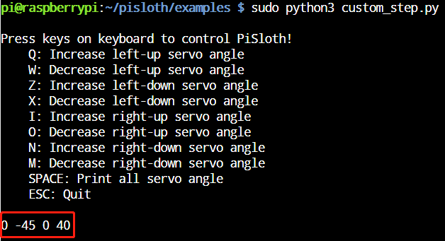

自定义步态
===============

在之前的项目中，我们使用了很多我们自己写的动作，那么这些动作是如何组合和完成的呢？一般来说，一个动作由一个或多个步态组成。

在这个项目中，我们将学习如何自定义 PiSloth 的步态。

.. note::

    您可以为您的 PiSloth 下载并打印卡通面具。
    
    * `卡通面具（.pdf） <https://gitee.com/sunfounder/sf-pdf/tree/master/%E5%8D%A1%E7%89%87/%E5%8D%A1%E9%80%9A%E9%9D%A2%E5%85%B7>`_

**运行代码**

.. raw:: html

    <run></run>

.. code-block::

    cd /home/pi/pisloth/examples
    sudo python3 custom_step.py

代码运行后，按下以下按键来调整PiSloth的各个舵机的角度。

* q: 增加左腿的角度
* w: 减小左腿的角度
* z: 增加左脚的角度 
* x: 减小左脚的角度
* i: 增加右腿的角度
* o: 减小右腿的角度
* n: 增加右脚的角度
* m: 减小右脚的角度
* 空格键: 打印所有角度
* ESC: 退出

比如按 ``zx`` 键和 ``nm`` 键，我们让它做出做如图所示的步态。

.. image:: img/diy_pic.jpg
  :width: 400
  :align: center

此时按 **空格键** 打印4个舵机的角度。您需要记录这些角度值，这些值将在下一个项目 :ref:`custom_action_python` 中使用。

**代码**

.. .. note::
..     You can **Modify/Reset/Copy/Run/Stop** the code below. But before that, you need to go to  source code path like ``pisloth\examples``. After modifying the code, you can run it directly to see the effect.

.. raw:: html

    <run></run>

.. code-block:: python

    from pisloth import Sloth
    # from robot_hat import Music
    # from robot_hat import TTS
    from robot_hat import PWM
    from robot_hat import Servo

    import sys
    import tty
    import termios
    import time

    sloth = Sloth([1,2,3,4])
    # tts = TTS()
    # music = Music()
    sloth.set_offset([0,0,0,0])

    right_leg_servo = Servo(PWM('P0'))
    right_foot_servo = Servo(PWM('P1'))
    left_leg_servo = Servo(PWM('P2'))
    left_foot_servo = Servo(PWM('P3'))

    def readchar():
        fd = sys.stdin.fileno()
        old_settings = termios.tcgetattr(fd)
        try:
            tty.setraw(sys.stdin.fileno())
            ch = sys.stdin.read(1)
        finally:
            termios.tcsetattr(fd, termios.TCSADRAIN, old_settings)
        return ch

    manual = '''
    Press keys on keyboard to control PiSloth!
        q: Increase the servo angle of the left leg
        w: Decrease the servo angle of the left leg
        z: Increase the servo angle of the left foot 
        x: Decrease the servo angle of the left foot
        i: Increase the servo angle of the right leg
        o: Decrease the servo angle of the right leg
        n: Increase the servo angle of the right foot
        m: Decrease the servo angle of the right foot   
        SPACE: Print all angle
        ESC: Quit
    '''

    def main():
        print(manual)
            
        left_leg=0
        left_foot=0
        right_leg=0
        right_foot=0
        while True:
            key = readchar().lower()
            # print(key)
            if key == "q":
                left_leg = left_leg+5
            elif key == "w":
                left_leg = left_leg-5
            elif key == "z":
                left_foot = left_foot+5
            elif key == "x":
                left_foot = left_foot-5
            elif key == "i":
                right_leg = right_leg+5
            elif key == "o":
                right_leg = right_leg-5
            elif key == "n":
                right_foot = right_foot+5
            elif key == "m":
                right_foot = right_foot-5
            elif key == chr(32): # 32 for space
                print(right_leg,right_foot,left_leg,left_foot)
            elif key == chr(27): # 27 for ESC
                break

            right_leg_servo.angle(right_leg) 
            right_foot_servo.angle(right_foot) 
            left_leg_servo.angle(left_leg) 
            left_foot_servo.angle(left_foot) 
            # time.sleep(0.05)

        print("\nQuit")

    if __name__ == "__main__":
        main()   
